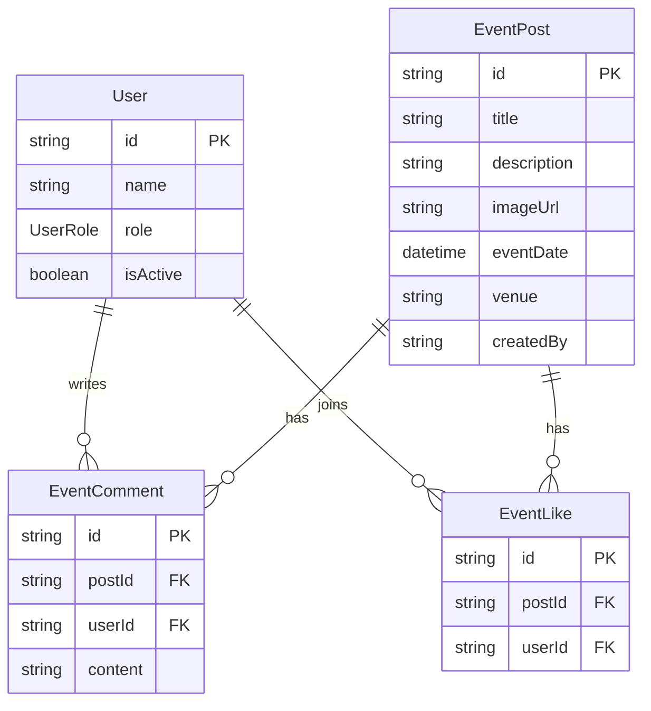
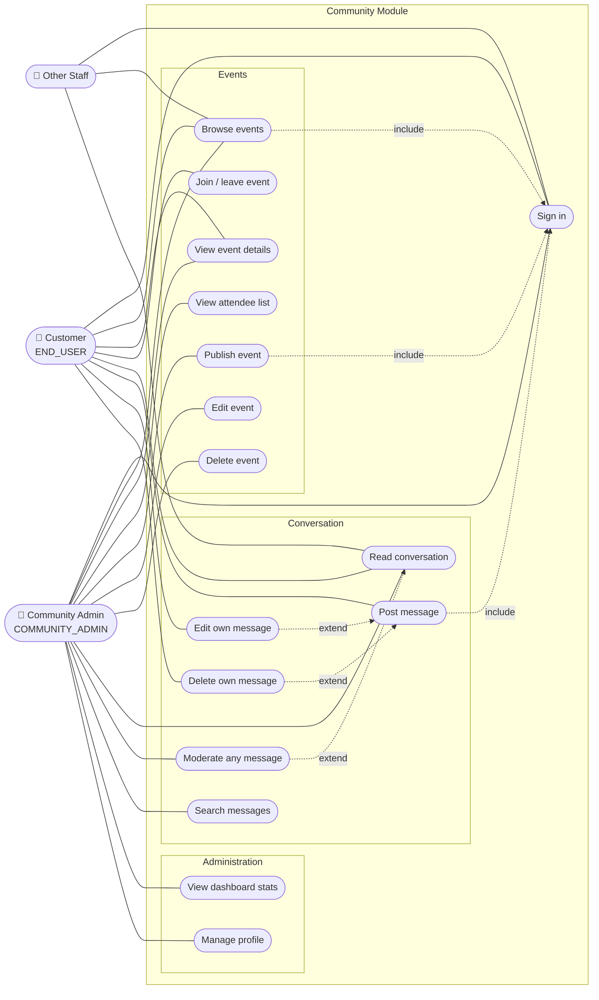

# Community Module — Analysis

Breakdown of the community feature of the Book Donation and Exchange Platform:
key features, use case diagram, and test cases.

Owner branch: `community-admin-kavindu`

---

## 1. Scope

The community module is the social layer of the platform. It does two things:

1. **Events** — the community administrator publishes events; customers browse
   them and join or leave.
2. **Conversation** — a single shared thread where customers talk to each other,
   moderated by the community administrator.

### Actors

| Actor | Role value | What they can do |
|---|---|---|
| Customer | `END_USER` | Browse events, join/leave, post messages, edit and delete **their own** messages |
| Community administrator | `COMMUNITY_ADMIN` | Publish/edit/delete events, see who joined, edit or delete **any** message, view dashboard statistics |
| Other staff | `PLATFORM_ADMIN`, `OPERATIONS_STAFF`, `DELIVERY_PERSONNEL` | Read events and messages only — explicitly blocked from joining or posting |

### Screens

| Route | File | Audience |
|---|---|---|
| `/community-home` | `pages/community/community_home.jsx` | Any signed-in user |
| `/community-admin/dashboard` | `pages/community/community_admin_dashboard.jsx` | `COMMUNITY_ADMIN` |
| `/community-admin/events` | `pages/community/event_management.jsx` | `COMMUNITY_ADMIN` |
| `/community-admin/messages` | `pages/community/community_management.jsx` | `COMMUNITY_ADMIN` |
| `/community-admin/profile` | `pages/community/CommunityProfile.jsx` | `COMMUNITY_ADMIN` |

Shared UI lives in `components/CommunityAdminUI.jsx` (components) and
`components/communityTokens.js` (palette, spacing, elevation, motion).

---

## 2. Key features

### 2.1 Event management (community administrator)

- **Publish an event** with title, description, date/time, optional venue and
  optional image URL. Title, description and date are mandatory.
- **Edit** and **delete** any event.
- **See the attendee list** — administrators receive participant *names*, while
  customers receive only a count plus their own join state.
- **Sort and search** events by title, venue or description; soonest-first or
  latest-first.
- **Upcoming vs past** is derived from `eventDate` against the current time.

### 2.2 Event participation (customer)

- **Join or leave** an event with one toggle. Restricted to `END_USER`; a
  deactivated account is refused.
- **Live participant count** returned on every toggle.

### 2.3 Community conversation

- **One shared thread** for the whole customer base.
- **Post a message** — max 1000 characters, empty messages rejected. `END_USER`
  only.
- **Edit or delete your own message**; the community administrator can edit or
  delete anyone's.
- **Group-chat presentation** — bubbles, own messages right-aligned, per-sender
  name colours, runs of messages collapsed, Today/Yesterday day separators.

### 2.4 Moderation (community administrator)

- **Dedicated moderation screen** listing every message newest-first.
- **Search** by message text or customer name.
- **Remove a message** behind a confirmation dialog naming the author.
- **Counts** of visible messages and messages posted today.

### 2.5 Dashboard

Four aggregates, all derived from existing records:

| Metric | Source |
|---|---|
| Active customers | count of `User` where role `END_USER` and `isActive` |
| Events this month | `EventPost` with `eventDate >= ` start of month |
| Messages today | `EventComment` on the conversation post since midnight |
| Total messages | all `EventComment` on the conversation post |

---

## 3. Data model

The module adds **no tables of its own**. It reuses three:

Two design decisions worth knowing:

1. **The conversation is an `EventPost`.** A sentinel row titled
   `__community_conversation__` is created on demand, and every community
   message is an `EventComment` on it. The event list filters that row out with
   `NOT: { title: COMMUNITY_POST_TITLE }`.
2. **Participation is an `EventLike`.** Joining an event writes a like row; the
   `@@unique([postId, userId])` constraint is what makes joining idempotent.

Both avoid a migration, at the cost of the table names not matching their
purpose.

---

## 4. API surface

All endpoints sit under `/api/community` and require a Bearer token.

| Method | Path | Guard | Purpose |
|---|---|---|---|
| GET | `/events` | authenticated | List events (shape differs by role) |
| POST | `/events` | `COMMUNITY_ADMIN` | Publish an event |
| PUT | `/events/:id` | `COMMUNITY_ADMIN` | Update an event |
| DELETE | `/events/:id` | `COMMUNITY_ADMIN` | Delete an event |
| POST | `/events/:id/participate` | `END_USER` | Toggle join/leave |
| GET | `/messages` | authenticated | List the conversation |
| POST | `/messages` | `END_USER` | Post a message |
| PUT | `/messages/:id` | owner or `COMMUNITY_ADMIN` | Edit a message |
| DELETE | `/messages/:id` | owner or `COMMUNITY_ADMIN` | Delete a message |
| GET | `/stats` | `COMMUNITY_ADMIN` | Dashboard aggregates |

---

## 5. Use case diagram

### Relationship notes

- Every use case **includes** *Sign in* — there is no anonymous access; the
  route guard rejects a missing or expired token with `401`.
- *Edit own message* and *Delete own message* **extend** *Post message*: they
  only apply to a message the actor authored.
- *Moderate any message* is the administrator's superset of the two above.
- *Other Staff* is deliberately read-only: `POST /messages` and
  `POST /events/:id/participate` both reject any role that is not `END_USER`.

---

## 6. Test cases

`TC-A` authentication · `TC-E` events · `TC-P` participation ·
`TC-M` messages · `TC-D` dashboard · `TC-U` interface

### 6.1 Authentication and authorisation

| ID | Test case | Precondition | Steps | Expected result |
|---|---|---|---|---|
| TC-A01 | Request without a token | Signed out | `GET /api/community/events` with no `Authorization` header | `401`, message "Authentication is required." |
| TC-A02 | Request with an expired token | Token past expiry | Call any community endpoint | `401`, "Your session has expired. Please sign in again." |
| TC-A03 | Customer blocked from admin screen | Signed in as `END_USER` | Open `/community-admin/dashboard` | Redirected away; `GET /stats` returns `403` |
| TC-A04 | Staff cannot publish an event | Signed in as `OPERATIONS_STAFF` | `POST /api/community/events` | `403`, "Community administrator access is required." |
| TC-A05 | Logout returns to home page | Signed in as `END_USER` or `COMMUNITY_ADMIN` | Click Logout | Lands on `/`, not `/login`; token and user cleared from storage |

### 6.2 Event management

| ID | Test case | Precondition | Steps | Expected result |
|---|---|---|---|---|
| TC-E01 | Publish a valid event | Signed in as admin | Submit title, description, future date | `201`; event appears in the list and on the customer page |
| TC-E02 | Title missing | Admin, form open | Leave title empty, submit | `400`, "Title, description, and event date are required."; nothing created |
| TC-E03 | Description missing | Admin, form open | Leave description empty, submit | `400`; nothing created |
| TC-E04 | Date missing | Admin, form open | Leave date empty, submit | `400`; nothing created |
| TC-E05 | Whitespace-only title | Admin, form open | Enter `"   "` as title | `400` — the guard trims before checking |
| TC-E06 | Venue and image optional | Admin, form open | Submit with venue and image blank | `201`; card shows "Venue to be announced" and the default image |
| TC-E07 | Edit an event | An event exists | Change the title, save | `200`; new title shown without a page reload |
| TC-E08 | Delete an event | An event exists | Confirm delete | Event gone; its comments and likes removed by cascade |
| TC-E09 | Edit a missing event | — | `PUT /events/{unknown-id}` | `404`, "Event not found." |
| TC-E10 | Conversation row hidden | Messages have been posted | `GET /events` as either role | The `__community_conversation__` post is **not** in the list |
| TC-E11 | Ordering | Several events exist | `GET /events` | Ascending by `eventDate` |
| TC-E12 | Upcoming vs past badge | One future, one past event | View the events screen | Future shows "Upcoming", past shows "Past" |
| TC-E13 | Search filters | Several events | Search a venue substring | Only matching events remain; count updates |
| TC-E14 | Search with no match | Several events | Search `zzzzz` | "No events match your search" with a Clear button — **not** the "create your first event" message |

### 6.3 Event participation

| ID | Test case | Precondition | Steps | Expected result |
|---|---|---|---|---|
| TC-P01 | Join an event | Customer, not joined | Click Join | `isParticipating: true`; count +1; button switches to joined state |
| TC-P02 | Leave an event | Customer, already joined | Click again | `isParticipating: false`; count −1 |
| TC-P03 | Double join is safe | Customer | Send `participate` twice quickly | Ends joined-or-left consistently; never two like rows (unique constraint) |
| TC-P04 | Admin cannot join | Signed in as admin | `POST /events/:id/participate` | `403`, "Only customer accounts can join events."; no Join button rendered |
| TC-P05 | Deactivated account | `isActive = false` customer | Attempt to join | `403`, "Your account cannot join events." |
| TC-P06 | Join a missing event | Customer | `POST /events/{unknown}/participate` | `404`, "Event not found." |
| TC-P07 | Customer sees no names | Two customers joined | Customer calls `GET /events` | Response carries `participantCount` and `isParticipating` but **no** `participants` array |
| TC-P08 | Admin sees names | Two customers joined | Admin calls `GET /events` | `participants` lists names; dashboard card shows "and N more" past three |

### 6.4 Conversation and moderation

| ID | Test case | Precondition | Steps | Expected result |
|---|---|---|---|---|
| TC-M01 | Post a message | Customer signed in | Type text, press Enter | `201`; bubble appears right-aligned; list scrolls to it |
| TC-M02 | Empty message | Customer | Submit only spaces | `400`, "A message cannot be empty."; send button stays disabled in the UI |
| TC-M03 | Length boundary — 1000 | Customer | Post exactly 1000 characters | Accepted |
| TC-M04 | Length boundary — 1001 | Customer | Post 1001 characters | `400`, "Messages must be 1000 characters or fewer." (UI caps input at 1000) |
| TC-M05 | Admin cannot post | Admin signed in | `POST /messages` | `403`, "Only customer accounts can post community messages." |
| TC-M06 | Deactivated account | Inactive customer | Attempt to post | `403`, "Your account cannot post messages." |
| TC-M07 | Edit own message | Customer owns a message | Edit, save | `200`; text updated |
| TC-M08 | Cannot edit another's | Customer B owns it | Customer A sends `PUT` | `403`, "You cannot edit this message."; no edit control shown |
| TC-M09 | Delete own message | Customer owns a message | Confirm delete | `204`; message removed from the thread |
| TC-M10 | Cannot delete another's | Customer B owns it | Customer A sends `DELETE` | `403`, "You cannot delete this message." |
| TC-M11 | Admin moderates any | Any customer message | Admin deletes it | `204`; disappears from both the moderation screen and the hub |
| TC-M12 | Missing message | — | `DELETE /messages/{unknown}` | `404`, "Message not found." |
| TC-M13 | Ordering — hub | Several messages | Open the conversation | Oldest first, newest at the bottom (chat order) |
| TC-M14 | Ordering — moderation | Several messages | Open moderation | Newest first |
| TC-M15 | Moderation search by author | Messages from several people | Search a customer name | Only that person's messages remain |
| TC-M16 | Moderation search no match | Messages exist | Search `zzzzz` | "No messages match that search" with Clear — **not** "No community messages yet" |
| TC-M17 | Delete cancelled | Admin, dialog open | Press Escape or click Cancel | Dialog closes; message still present; no request sent |
| TC-M18 | Deleting user removes messages | Customer with messages | Delete the user account | Their comments removed by cascade |

### 6.5 Dashboard

| ID | Test case | Precondition | Steps | Expected result |
|---|---|---|---|---|
| TC-D01 | Active customer count | Known number of active `END_USER` rows | Open the dashboard | Matches; inactive and staff accounts excluded |
| TC-D02 | Events this month | Events inside and outside the month | Open the dashboard | Counts only `eventDate >=` start of month |
| TC-D03 | Messages today | Messages today and yesterday | Open the dashboard | Counts only since midnight |
| TC-D04 | Conversation excluded from events | Messages exist | Read "Events this month" | The sentinel post is not counted |
| TC-D05 | Empty state | No events published | Open the dashboard | "No events published yet" plus a Create an event action |
| TC-D06 | Loading state | Slow network | Open the dashboard | Card skeletons hold the layout; no "no data" flash |
| TC-D07 | Backend unavailable | API stopped | Open the dashboard | Error banner announced with `role="alert"`; page still usable |

### 6.6 Interface and accessibility

| ID | Test case | Precondition | Steps | Expected result |
|---|---|---|---|---|
| TC-U01 | Keyboard navigation | Any admin screen | Tab through the page | Sidebar links reachable; visible focus ring on every control |
| TC-U02 | Skip link | Dashboard | Tab once from page load | "Skip to content" appears and jumps past the sidebar |
| TC-U03 | Mobile drawer | Viewport < 768px | Open the menu, press Escape | Drawer closes; background does not scroll while open; closed drawer is not tabbable |
| TC-U04 | Account menu keyboard | Any admin screen | Open it, press Escape | Closes and focus returns to the trigger button |
| TC-U05 | Event actions without a mouse | Events screen | Tab to a card | The Edit/Delete menu is reachable and visible on focus |
| TC-U06 | Form labels | Event form | Click each field label | Focus moves into the matching input |
| TC-U07 | Own vs other messages | Conversation with both | Inspect the thread | Own bubbles right-aligned in the soft teal; others left on white with a coloured sender name |
| TC-U08 | Message grouping | Two messages, same person, < 5 min apart | View the thread | Second message has no avatar and no repeated name |
| TC-U09 | Day separators | Messages across two days | Scroll the thread | "Yesterday" and "Today" dividers appear at the boundaries |
| TC-U10 | Scroll behaviour | Long thread | Scroll up, then a new message arrives | The view is **not** yanked to the bottom; sending your own message does scroll down |
| TC-U11 | Enter vs Shift+Enter | Composer focused | Press each | Enter sends; Shift+Enter inserts a newline |
| TC-U12 | Reduced motion | OS "reduce motion" on | Load any community screen | Skeleton shimmer and spinners do not animate |
| TC-U13 | Responsive chat | Viewport < 640px | Open the conversation | Bubbles widen, no horizontal scrolling |
| TC-U14 | Brand mark | Any community screen | Inspect the header | Same book icon and "ShareShelf" wordmark as the main site navbar |

---

## 7. Known issues and risks

| # | Issue | Impact |
|---|---|---|
| 1 | The conversation depends on a magic title string `__community_conversation__` | Anyone creating an event with that exact title would collide with the thread. A boolean column or a dedicated table would be safer. |
| 2 | `EventLike` doubles as attendance | "Likes" and "attendance" can never be distinguished later without a migration. |
| 3 | `getConversationPost()` can race | Two simultaneous first-ever posts could both find no post and both create one. An upsert on a unique field would remove the risk. |
| 4 | No pagination on `GET /messages` | The whole thread is returned on every load; this will degrade as the thread grows. |
| 5 | No rate limiting on message posting | `POST /messages` is only behind the general API limiter, so the thread can be flooded. |
| 6 | Messages are stored and rendered as plain text | Safe today because React escapes output — but anything switching to `dangerouslySetInnerHTML` would introduce XSS. |
| 7 | `PUT /messages/:id` lets an admin edit a customer's words | Editing rather than removing another person's message is a questionable moderation power. |
